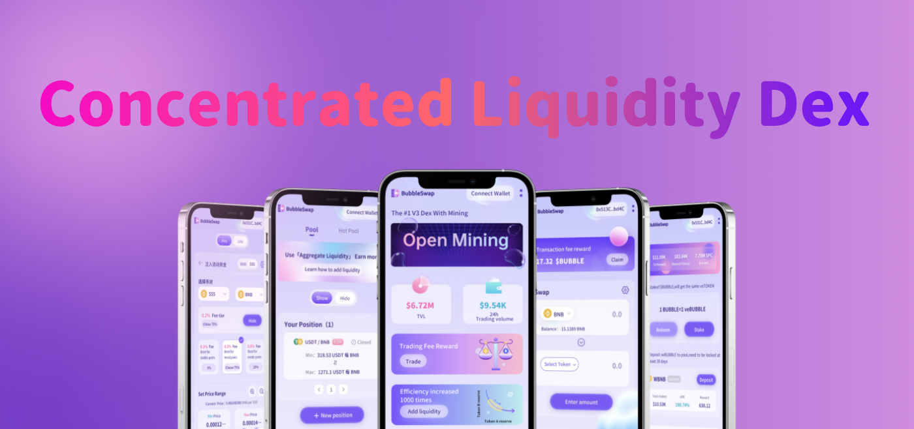

# 🌊 About Bubbleswap

<figure><figcaption></figcaption></figure>


**Bubbleswap is a concentrated liquidity market maker (CLMM) that allows LPs select price range and fee tiers on Aptos & Ethereum. It's fast, cheap, and allows anyone to participate.**

**Will soon become an influential DEX on Aptos & Ethereum**


### Decentralized Token Trading

> Start trading virtual currency immediately: no account registration required

### High Capital Effiiciency 

With concentrated liquidity market maker, we are 1000 times more efficient than any V2 exchange&#x20;

### Fees 

We have mutiple fee tiers, most existing AMMs effctively give LPs only one fee tier

But we give LPs 4 fee tiers (0.01% / 0.05% / 0.3% / 1%), you can choose the right fee tiers is more profitable!

### Decentralized

Start trading directly from your wallet app. Unlike centralized exchanges like FTX or Binance, Bubbleswap does not hold your funds while trading: <mark style="color:orange;">You own 100% of your cryptocurrency.</mark>

### $BUBBLE 

* Governance by _**$BUBBLE**_ vote
* Exchange tokens on Bubbleswap to earn _**$BUBBLE**_
* Stake LP to earn _**$BUBBLE**_
* Stake _**$BUBBLE**_ to earn ETH\&APT
* Stake _**$BUBBLE**_ to earn other tokens
* Buy some new tokens at Bubbleswap launchpad by using _**$BUBBLE**_

### Safety

CertiK audit passed - [https://www.certik.com/projects/bubbleswap](https://certik.com/projects/bubbleswap)
