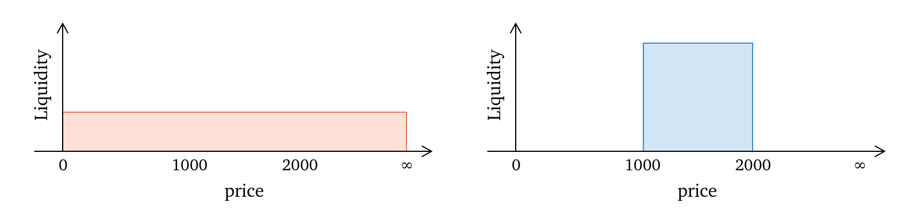

# Concentrated liquidity

The earlier version of AMM forces LPs to allocate capital on the price range of (0, ∞). This is wasteful because a large part of the liquidity will never be put into service, as token price will very unlikely jump to extremely high or fall to zero during your time of providing liquidity.

Bubbleswap inherits the existing design of concentrated liquidity. Instead of forcing LPs to provide liquidity on the (0, ∞) price range, allows LPs to concentrate their capital into the price ranges they selected. Using a narrow price range, LPs can amplify their liquidity with the same amount of capital.

<figure><figcaption>
Left: full range liquidity.       Right: concentrated liquidity
</figcaption></figure>
