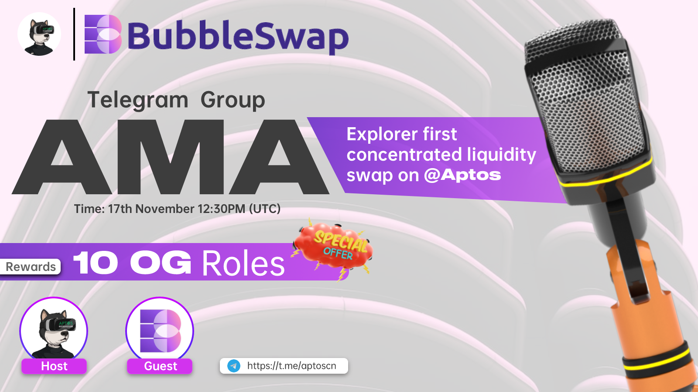

# AMA With AptosCN

<figure><figcaption></figcaption></figure>

_AptosCN: Welcome to the Bubbleswap team to our community!_

**Hi everyone, happy to here**

_1）欢迎来到我们的社区，向大家介绍一下你自己以及简单介绍一下Bubbleswap。_&#x20;

_Welcome to our community, tell us about yourself and a little about Bubbleswap._

**hello, i'm Zak from India and the founder of bubbleswap, bubbleswap is a concentrated liquidity swap on ethereum and aptos, with mutiple fee tiers and yield farming.**

_2）能介绍一下你们团队成员方面的情况吗？以及在这个行业的经验？_&#x20;

_Can you tell us about your team members? And experience in this industry?_

_**yea sure,**_** currently the team consists of community manager and myself as dev, we have a very good rapport and early eth investors, haveing build a decentralized perpetual product last year but did not live on mainnet.**

_3）你们为什么会选择部署在Aptos网络?你们也在#Ethereum部署了吗？_&#x20;

_Why did you choose to deploy on the Aptos network? Are you also deploying on #Ethereum?_

**We'll launch on ethereum first and then on aptos, cgoosing to extend aptos cuz it's a high performance L1 that serves a large number of users, we'll expand to more chains in the future.**

_4）你们的平台目前有哪些功能或者说你们将做成一个什么样的平台，项目的机制以及如何操作你能跟大家介绍一下吗？ What functions does your platform currently have or what kind of platform you will make, the mechanism of the project and how to operate it, can you introduce it to everyone?_

**In short, we r the pro version of uniswap v3, traders can trade with 0 fees, cuz we have trading rewards to return fees, and Lps also can mining or stake tokens to earn more, we want to bring V3 to every chain, Make DeFi more capital efficient.**

_5）Aptos上面的DEX项目上也有不少，你们有什么突出的有点？或者说人们为什么选择你们？ There are also quite a few DEX projects on Aptos. What do you stand out from? Or why do people choose you?_

**It's more about capital efficiency and like mining/stake to boost user's revenue.**

**Also, BUBBLE have many uses**

**-Governance by $BUBBLE vote**&#x20;

**-Exchange tokens on Bubbleswap to earn $BUBBLE**&#x20;

**-Stake LP to earn $BUBBLE**&#x20;

**-Stake $BUBBLE to earn ETH\&APT**&#x20;

**-Stake $BUBBLE to earn other tokens**&#x20;

**-Buy some new tokens at Bubbleswap launchpad by using $BUBBLE**

_6）能介绍一下你们路线图吗吗？或者商业规划吗？ Can you tell us about your roadmap? Or business planning?_

**we are in the process of IDO, but it's a failure, and following the refund of all the users there will be an option to launch directly.**

**we plan to launch on Ethereum around 25th, Aptos around 30th, and expand to more chains within three months.**

_7）关于 $BUBBLE 代币经济学，你能详细介绍一下吗？ Can you elaborate on the $BUBBLE token economics?_

**Total supply is 1b, aptos and eth are 500m each.**

**Yield farming 40%**&#x20;

**Trading rewards 20%**&#x20;

**IDO(will burn) 4%**&#x20;

**Liquidity 4%**&#x20;

**Branding 3%**&#x20;

**Investor(No investor, will burn soon) 10%**&#x20;

**Team 15%**&#x20;

**Airdrop 2%**&#x20;

**Marketing 2%**

_8）你们的项目目前处于什么样的一个阶段，我发现你们已经推出了网站，现在可以使用了吗？_ [_https://bubbleswap.co/_](https://bubbleswap.co/) _What stage is your project at now, I see you have launched your website, is it ready to use now?_ [_https://bubbleswap.co/_](https://bubbleswap.co/)__

**Not yet, sir**

**As i said before, will launch around 25th.**

_9）你们有没有针对社区或者爱好者的奖励计划。你可以介绍大使计划吗？ Do you have a rewards program for the community or enthusiasts. Can you introduce the ambassador program?_

**Yea, there are 4 roles in our server**

**Contributor(full): the highest role, need to get 3000 xp on Crew3.**&#x20;

**Booster(24/30): the first users who boost the server.**&#x20;

**OG(226/300): this is the second highest role, need to get 1500 xp on Crew3.**&#x20;

**Member**

_10）说到DEX，我们肯定会想到CEX，最近你们受到FTX交易所事件的影响吗？对这个事情你们怎么看？ When it comes to DEX, we definitely think of CEX. Have you been affected by the FTX exchange incident recently? What do you think about this matter?_

**Our exposure to ftx is 0, cex dominated the market for long time, but there were 2 many problems, in short, long DeFi !**

_11）最近加密市场整个行业并不景气，当然Aptos生态也不是很活跃，你们怎么看？ Recently, the crypto market as a whole has been in a downturn. Of course, the Aptos ecosystem is not very active. What do you think?_

**This is the second bear market i've spent, i'll continue to build during this period until the bulls shine, a brief downturn doesn't matter i think**

_12）关于社区方面，你认为我们可以在哪些方面加强合作?这样可以帮助Aptos生态的发展。 Regarding the community, in what areas do you think we can strengthen cooperation? This can help the development of the Aptos ecosystem._

**I think we can improve cooperation with the community by collaboration, open source code, or something like this**

_你还有其他补充介绍的吗？如果没有我们将进入社区自由问答。 Do you have anything else to add? If not we will enter the community free Q\&A._

**No more, don't forget join our server !**
