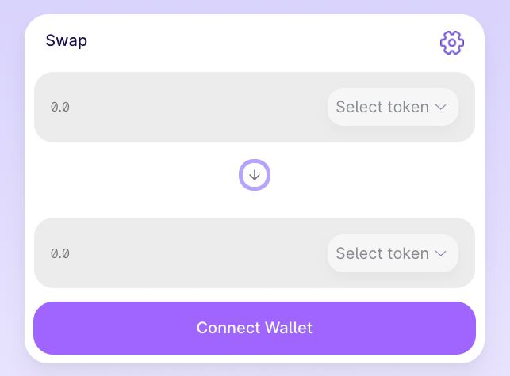
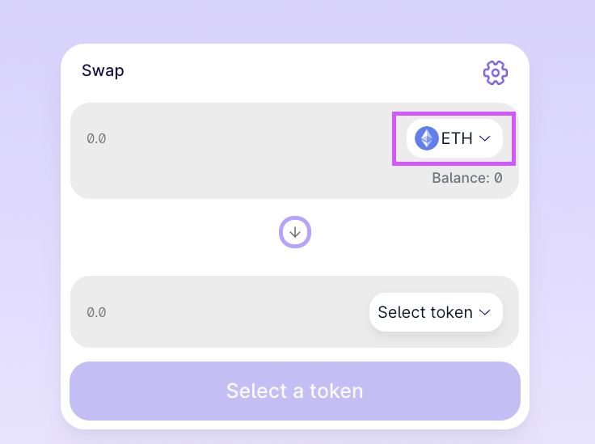

# How to Trade

Trading on BubbleSwap is very easy compared to most exchanges. You aren't going to be overwhelmed by charts or jargon, and calculations are all handled for you.

### Getting set up to trade

Before you can trade, you will need a Ethereum-compatible wallet. You can learn how to get one [here](../../get-started-eth/create-a-wallet.md). You will also need to have some ETH tokens to trade with. You can learn how to get some [here](../../get-started-eth/get-erc20-tokens.md).

Trading on the BubbleSwap exchange

1\. Go to the exchange page [here](https://app.bubbleswap.co).

2\. Unlock your Ethereum-compatible wallet by clicking Unlock Wallet (you can also Connect in the top right-hand corner). If you haven't yet connected your wallet to BubbleSwap, you can view the guide to [here](../../get-started-eth/connect-your-wallet-to-bubbleswap.md).

<figure><figcaption></figcaption></figure>

3.Choose the token you want to trade from the dropdown menu in the "Form" section, the default setting is ETH.

<figure><figcaption></figcaption></figure>

Whichever token you choose, you will need to make sure you have some to trade with, your balanse is shown above the token dropdown menu.

4\. Choose the token you want to trade as above. Next, type an amount for your to currency by clicking inside the input box.

Your "From" currency amount will be estimated automatically. You can also type your "From" amount and have the "To" amount estimate automatically if you like.

5\. Check the details, and click the **Swap** button

6\. A window with more details will appear. Check the details are correct.

When you are ready, click the Confirm Swap button. Your wallet will ask you to confirm the action.

7\. Done! You can click View on EtherScan to see your transaction details on the explorer.
