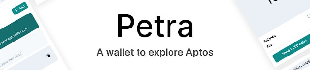
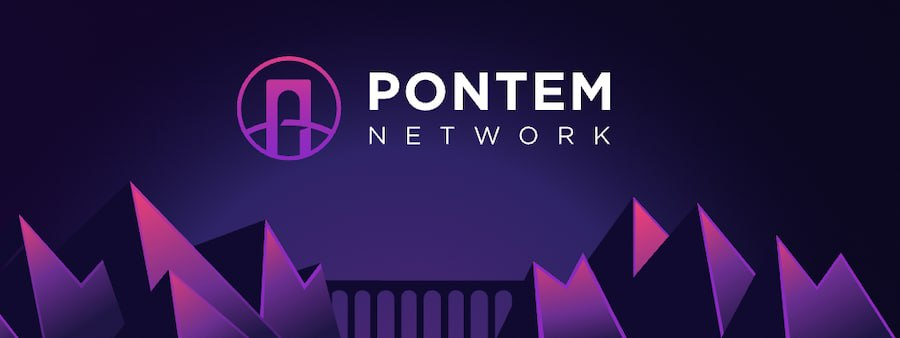

# Create a wallet

To start using BubbleSwap, you first need to set up a wallet that supports the Aptos chain.

**When setting up your wallet, it is important to note:**

✅ Download and install the latest version of the wallet app from trusted official channels.

✅ Read and follow the setup guide carefully.

✅ Properly back up the mnemonic or private key used to restore the wallet

❌ Under no circumstances: disclose your recovery mnemonic or private key to anyone!

❌ Under no circumstances: enter your recovery mnemonic or private key on any website!

&#x20;



<figure><figcaption></figcaption></figure>

Petra wallet is an extension that lets you explore Aptos in your browser.

### **Highlights:**

* Built by Aptos Labs
* Easy to use
* Supports multiple accounts
* Built-in NFT support
* Supports Aptos testnet and one-click testnet APT faucet

### Note:

* Desktop only
* Only supports Aptos chains

[Download Petra Wallet](https://petra.app)

[Petra Wallet Setup Guide](https://petra.app/docs/use)



<figure><figcaption></figcaption></figure>

Martian is an Aptos Chain wallet that allows you to store, send, receive tokens and manage & mint NFTs. Its mobile version is coming soon.

### Highlights:

* Mobile version coming soon
* Easy to use
* Supports multiple accounts
* Built-in NFT support
* Supports Aptos testnet

[**Download Martian Wallet**](https://martianwallet.xyz)****



<figure><figcaption></figcaption></figure>

Pontem Wallet is an Aptos Chain wallet that allows you to store, send, receive tokens, and connect to dApps on the Aptos ecosystem.

### Highlights:

* Mobile version coming soon
* Easy to use
* Supports multiple accounts
* Built-in NFT support
* Supports Aptos testnet

****[**Download Pontem Wallet**](https://pontem.network/pontem-wallet)****



**Tip: The mnemonic is your "bank card number + password". Anyone who masters the mnemonic can operate all your assets in the wallet on the blockchain! Be sure to use a variety of methods to keep it safe, and never give anyone your private key or mnemonic phrase under any circumstances. If someone asks you for your private key or mnemonic phrase, please report it and ban it immediately.**

Admins will never initiate private chats with you. If someone contacts you directly posing as customer service, please click Block immediately and report it as spam.
