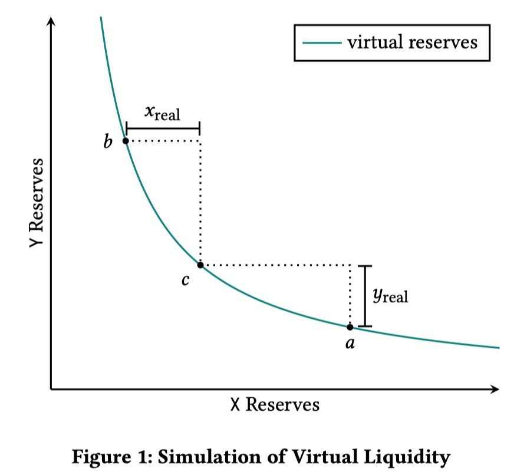
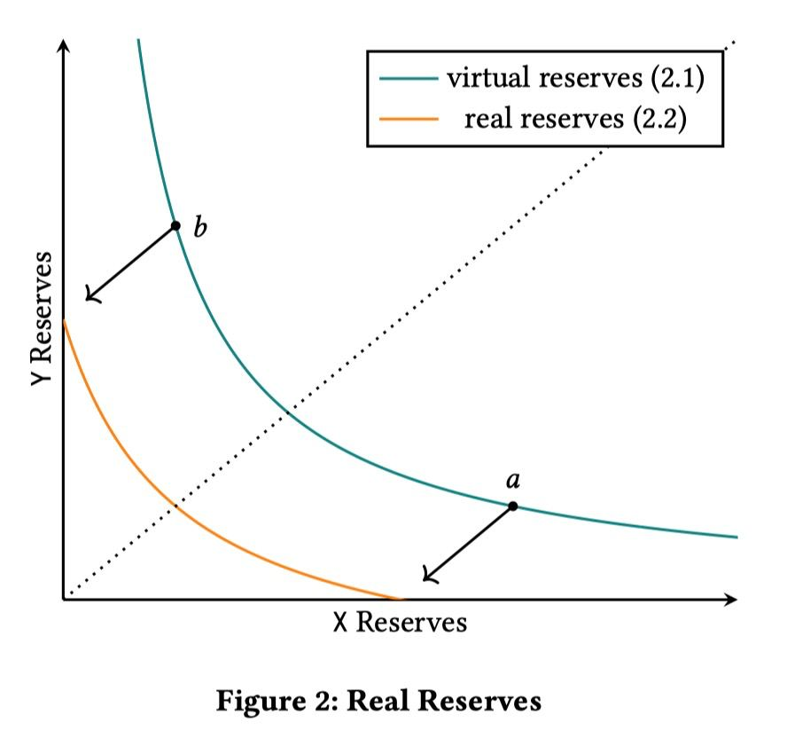
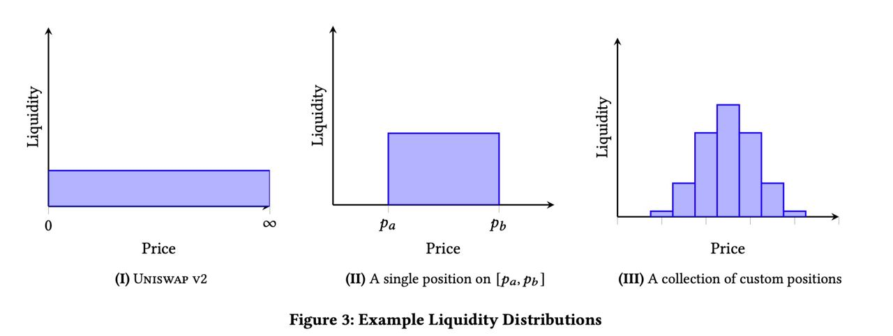
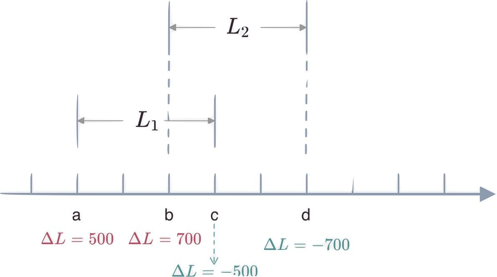

# 🤖 Liquidity Math

### **Solution** 

The solution in v3 is to allow users to add liquidity only within a certain price range.&#x20;

<figure><figcaption></figcaption></figure>

This image shows $$x \cdot y = k$$ a of the function graph. To satisfy the need to give the user the option of only $$\begin{bmatrix}   a,b \end{bmatrix}$$Liquidity is provided within the price range. For the chart $$\begin{bmatrix}   a,b \end{bmatrix}$$any point in the interval with.

&#x20;                                                            $$y=y_{virtual}+y_{real}$$

&#x20;                                                            $$x=x_{virtual}+x_{real}$$

of which $$x_{real}$$, $$y_{real}$$denote respectively the user-supplied x token, y token Number,$$x_{virtual}$$,$$y_{virtual}$$ The number of x tokens and y tokens virtualised by the liquidity pool are indicated respectively.&#x20;

Note that the virtual x tokens and y tokens are for consistency purposes only and do not participate in real transactions, so their numbers are constant.

When the price of the liquidity pool reaches the 0 threshold set by the user 
(e.g. point a or point b in the diagram), the actual x token or y token provided by the user will be zero and x or y will consist entirely of virtual tokens.&#x20;



In order to keep the virtual token constant, when the price moves further outside the price range set by the user, the liquidity pool removes this liquidity to ensure that the number of virtual x tokens or y tokens does not decrease, so that this virtual token only participates in the calculation of the price when the price is within the set range, and does not actually participate in the provision of liquidity (i.e. The number of virtual tokens is constant and does not change in volume).

For example, when the price reaches point a, all of the user's money is converted to x, at which point $$y_{real}=0$$, $$y=y_{virtual}$$, As the price continues to fall, the liquidity pool will remove this liquidity. The user's funding status will remain at point a until the price returns to point a again and enters $$\begin{bmatrix}   a,b \end{bmatrix}$$Price range.


With this design, the user's money will only be $$\begin{bmatrix}   a,b \end{bmatrix}$$Provides liquidity within the price range and because the virtual token $$x_{virtual}$$, $$y_{virtual}$$of participation, this liquidity also meets $$x \cdot y = k$$formula, the way in which the price is calculated has not changed Transformation.

<figure><figcaption></figcaption></figure>

The chart above shows the user choice in price $$\begin{bmatrix}   a,b \end{bmatrix}$$When providing liquidity between the two, the participation of virtual tokens will curve $$f\left ( real \right )$$(orange) moves up to the right to $$f\left ( virtual \right )$$(green), achieving consistency in price calculations (i.e. meeting $$x \cdot y = k$$）。

### **Trading process**

In the v3 version, because there will be several liquid pools of different depths in a single pool (each of which can be set up with a separate trading price range), the process of a single trade may span several different depths.


<figure><figcaption></figcaption></figure>

As shown on the far right of the chart above, when prices change, so does the total liquidity in the liquidity pool. Therefore the relationship between the funds in the liquidity pool in the v3 version cannot be represented by a smooth bonding curve as in the v2 version. So how are the trading results calculated?

As we said earlier, V3 behaves like a trade aggregator in that it needs to ensure that the prices of all the liquidity in the pool are consistent before and after the trade. V3 therefore works around the prices of the tokens in the pool.

For a liquidity, the size of the liquidity can be measured by$$k$$ indicates that $$k=x\cdot y$$, with $$P$$expresses $$X$$The price of $$p=\frac{y}{x}$$.


For a liquidity, when exchanging x token for y token, we need to perform the following calculation.

Trade to a specified price (not to exceed this liquidity boundary price) $$P$$, Number of x tokens required $$\Delta x$$,The number of y tokens that can be obtained from $$\Delta y$$
 given x number of tokens$$\Delta x$$ (assuming no price is triggered beyond this liquidity boundary price), the number of y tokens that can be obtained$$\Delta y$$ , 
 and the final price $$P$$&#x20;

When the value of k is constant, by definition,

$$
\left\{\begin{matrix}
  x\cdot   y=k \\
  P= \frac{y}{x}    
\end{matrix}\right.
$$

It can be deduced that,\

$$
\left\{\begin{matrix}
  x  =\sqrt{\frac{k}{P} }  \\
  y  =\sqrt{kP} 
\end{matrix}\right.
\Rightarrow 
\left\{\begin{matrix}
  \Delta x  =  \Delta \frac{1}{\sqrt{P} }\cdot \sqrt{k}   \\
  \Delta y  =  \Delta \sqrt{P}\cdot \sqrt{k}  
\end{matrix}\right.
$$

This way the calculation process does not need to focus on the x token and y token balances in the liquidity by $$k$$ and price $$P$$ The calculation of the transaction process can then be completed.



To reduce the number of open root operations in the calculation process, the v3 contract is stored directly $$\sqrt P$$ value, while the contract does not store the value of $$k$$ Instead of storing the value of$$L = \sqrt k$$ , by $$L$$ (There is also the benefit of reducing the possibility of spillovers).

In the actual trading process, a transaction will be completed by aggregating multiple liquidities. The above formula will therefore be completed by aggregation, i.e. using the sum of liquidity at the current price, which can be expressed as follows $$L_{total} = \sum L_{user}$$
This is the sum of all liquidity sizes within the current price range.

At the same time, a trade may also span different liquidity stages (i.e. it may exceed or enter a certain liquidity), so the contract needs to maintain a price boundary for each user to provide liquidity, and when the price reaches the boundary, the corresponding liquidity size needs to be added to or removed from the total liquidity. The calculation of the trade result is done by means of a segmented calculation.


### **Price accuracy**

This is because the user can set up any $$[P_0, P_1]$$to provide liquidity within the price range, v3 needs to keep the boundary price at which each user provides liquidity, i.e $$P_0$$ and $$P_1$$. This introduces a new problem. Assuming that the two users offer liquidity with price floors of 5.00000001 and 5.00000002 respectively, the corresponding liquidity sizes need to be marked for prices of 5.00000001 and 5.00000002. Also when a transaction takes place, it is necessary to mark the $$[5.00000001, 5.00000002]$$ be calculated as a separate price range. 



**This would result in;**

* It is almost difficult to have two liquidity settings with the same price boundary, which can lead to a large amount of contract storage space being consumed to hold this state
* When performing trade calculations, price changes are sliced into many small range intervals and need to be calculated in segments, which can consume a lot of gas and may cause problems with calculation accuracy if the spread of the range is too small

We solve this problem by splitting $$[P_{min}, P_{max}]$$  This continuous range of prices is divided into a finite number of discrete price points. Each price corresponds to a tick, and the user can only select one of these discrete price points as the liquidity boundary price when setting the price range for liquidity.

The price range is determined in the form of an isometric series with a common ratio of 1.0001. i.e. the next price point is 100.01% of the current price point and as we said earlier v3 actually stores $$\sqrt P$$, Then the next price in relation to the current price is

$$
\sqrt {P_{next}} = \sqrt {1.0001} \cdot \sqrt {P_{current}}
$$

In this way v3 can provide a relatively fine-grained range of price choices (0.01% difference between each available price), while keeping the complexity of the calculation within limits.

### **Tick management**&#x20;

Simply put, a tick represents one of the prices in the equiprobable series of v3 prices, so the price bounds for each user-provided liquidity can be represented by $$tick_{lower}$$ and  $$tick_{upper}$$**.**\
For ease of calculation, each pair is defined to have a tick with a price of 1. For ease of calculation, each pair is defined to have a tick with a price of 1. All ticks are represented by an index, and an integer is defined to represent the index of the tick

$$
i = \log_{\sqrt {1.0001}}{\sqrt p}\
$$

In this way, it is only necessary to pass the integer index $$i$$  The corresponding tick will be found and $$i$$ If the price is 0, the price is 1.

Instead of recording all the information for each tick, you only need to record all the mobility metadata contained as the upper/lower tick. Look at the following example.

<figure><figcaption></figcaption></figure>

Two users each in $$[a, c]$$and $$[b, d]$$and Two zones provide liquidity $$L_1$$and $$L_2$$, For v3 it will record the corresponding liquidity increases and decreases on the a, b, c and d ticks. For example, as the price moves from left to right in the graph, the liquidity of the token pool is increased or decreased 
(i.e. liquidity is increased when a tick enters from the left and decreased when the right tick moves out of liquidity).
