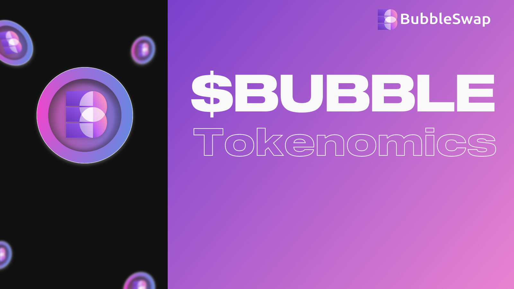

# $BUB

<figure><figcaption></figcaption></figure>

* Token Symbol：$BUB
* Token Name：Bubbleswap
* Total Supply: 10,000,000
* Token Precision: 18
* Year of casting: 4 years

<table><thead><tr><th width="250" align="center">Uses</th><th width="162.33333333333331" align="center">Percentage</th><th align="center">Release</th></tr></thead><tbody><tr><td align="center">Yield Farming</td><td align="center">40%</td><td align="center">4-year linear release</td></tr><tr><td align="center">Trading Rewards</td><td align="center">10%</td><td align="center">4-year linear release</td></tr><tr><td align="center">Team</td><td align="center">10%</td><td align="center">2-year linear release</td></tr><tr><td align="center">Investor (Will Burn)</td><td align="center">10%</td><td align="center">20% TGE, 3 month cliff with 12 month linear vesting</td></tr><tr><td align="center">IDO</td><td align="center">8%</td><td align="center">100% Unlock at TGE</td></tr><tr><td align="center">Liquidity</td><td align="center">8%</td><td align="center">100% Unlock at TGE</td></tr><tr><td align="center">Airdrop</td><td align="center">10%</td><td align="center">100% Unlock at TGE</td></tr><tr><td align="center">Marketing</td><td align="center">4%</td><td align="center">12-months linear release</td></tr></tbody></table>

* Contract address (Bitlayer): 0xab14604b86489a32bbe0e537b93c74ea532e27cf

### Basic Information

&#x20;$BUB is a token that supports the entire ecosystem of Bubbleswap and is earned through farms and stake.

* Use LP token in the farm for liquidity mining to get more $BUB.
* Staking $BUB to earn $BTC
